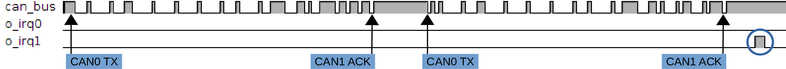
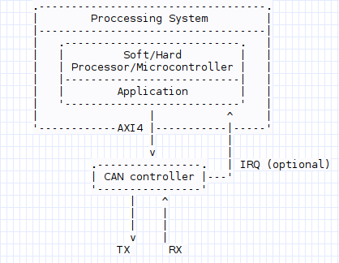
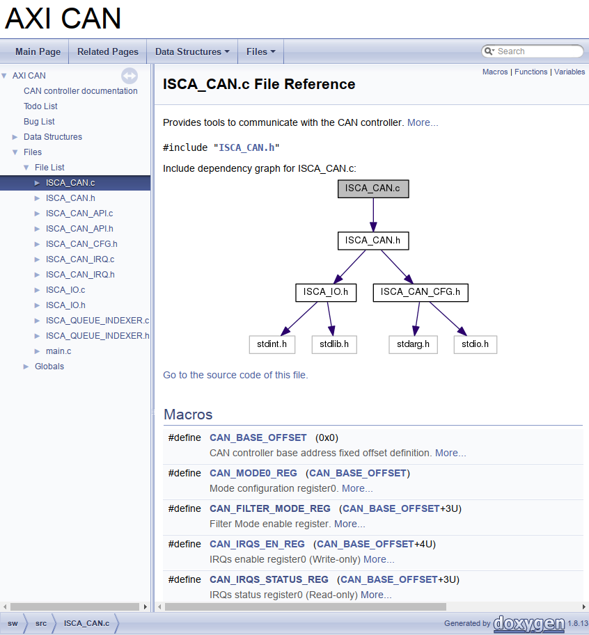

# CAN-bus Controller with AXI4-lite Interface

Document's sections structure:  
[Overview](#overview)  
[Publications](#publications)  
[Design Information](#design-information)  
[How-to-use](#how-to-use)  
[Disclamer](#disclamer)  
[Contact Information](#contact-information)  

## Overview

This project provides information and resources, in terms of hardware (synthesizable HDL code), software (C code) and documentation that enable the evaluation and testing of CAN-bus controllers operation and communication. Development boards equipped with FPGA and/or micro-controller and/or processor, which provides communicataion links between them, are suitable for porting this project. The provided sources have been tested over development boards equipped 32-bit ARM processors/micro-controllers, i.e., Zedboard (Xilinx Zynq-7000 + Cortex-A9) and SEcube (Lattice MachXO2 + Cortex-M4).  

This work was partially funded by [TAPPS](http://www.tapps-project.eu/) Horizon2020 framework EU-funded project, [ISCA-lab](http://isca.hmu.gr/), colleagues and me, in order to fulfill project's and lab's goals. Demo videos related to [TAPPS](http://www.tapps-project.eu/), with additional H/W and S/W extensions based on the requirements, can be found at [ISCA-lab](http://isca.hmu.gr/)'s [Youtube channel](https://www.youtube.com/channel/UCrP1FrI0Lc0TXkrVJ9Qgu0w/videos).

Former and current colleages participated in the creation of the integrated system shown in videos (TAPPS demo videos):

* Bakoyiannis Dimitrios - d.bakoyiannis@gmail.com
* Deligiannis Ioannis - i_-_-_s@outlook.com  
* Karadimitriou Nikolaos - karadimnik@gmail.com  

## Publications

**Hardware-assisted Security in Electronic Control Units, Secure Automotive Communications by Utilizing One-Time-Programmable Network-on-Chip and Firewalls,** *G. Kornaros, O. Tomoutzoglou and M. Coppola*, Sept./Oct. 2018,  [IEEE micro](https://ieeexplore.ieee.org/document/8474944)

**Secure Over-the-air Firmware Updating for Automotive Electronic Control Units,** *D. Mbakoyiannis, O. Tomoutzoglou and G. Kornaros, Apr. 2019,  [ACM SAC '19](https://dl.acm.org/citation.cfm?id=3297299)

A preprint of the first publication can be found at [ISCA-lab](http://isca.hum.gr/)'s site.

## Design Information

### Hardware

The following, already implemented, cores have been used in order to achieve this project's goals:  

* [CAN Protocol Controller](https://opencores.org/project/can), authored by Igor Mohor (<igorm@opencores.org>)
* [Simple AXI4-Lite bridges for IPbus and Wishbone](https://opencores.org/project/ax4lbr), authored by Wojciech M. Zabolotny  (<wzab@ise.pw.edu.pl>)  

**_Contribution_**  

* Patch files for the CAN controller that enables 8-bit addressing over a 32-bit addressable environment, provide  access to extra added or already implemented registers, enriching interaction with the CAN controller; prevent faulty interrupt generation under certain circumstances etc. More information about the modifications made can be found in the header of the patched verilog sources
* Patch file for the AXI lite to WishBone adapter, to properly communicate with CAN controller's WishBone IF.
* A top module that wraps CAN controller and axi4-lite to wishbone adapter ([axi_can.v](hw_srcs/rtl/axi_can.v))
* Test-bench sources ([axi_can_tb.v](hw_srcs/bench/axi_can_tb.v))

**_Testbench info_**

* T = 10ns
* Two CAN controllers instances  
    1. Operating in 2B (extended) mode with extended CAN frame format enabled
    2. Baud rate: 1000 kbps
    3. Filter (drop) all the CAN frames with header ID[28] equal to zero
    4. Single filtering
    5. Interrupt mode activated only for receiving CAN frames (active high)

During the test-bench two CAN controllers are instantiated; the first instance is ordered to send two CAN frames, where the first one's header MSB is '0', while the other one's is '1'; consecutively it is ordered to the second instance to read a CAN frame (IRQ mode). Although the second instance acknowledges both the frames (physical-layer), only one of the frames is forwarded to upper-levels (i.e., two frames, one RX interrupt), as the one with header's MSB equal to '0' is dropped by the filter's rules.  

Expected waveform (only CAN bus & IRQs)  

<!---
   
--->

**_BAUD rate formula_**

  

<!---
$$
Baud\ Rate=\frac{1}{(BPR*clk\_period)*(1+TSEG1+TSEG2))}
$$
--->

**_NOTE 0_**

> BRP (Baud Rate Prescaler), TSEG1 (Time SEGment), TSEG2 and SJW (Synchronization Jump Width)are the final values that CAN controller's Bit Time Logic uses, not the ones set through the API. The following list gives the mapping from the API given to the actual value that HW perceives:
> 
  

<!---
$$
\begin{aligned} 
BRP &\mapsto 2*(BRP+1) \\
TSEG1 &\mapsto TSEG1+1 \\
TSEG2 &\mapsto TSEG2+1 \\
SJW &\mapsto SJW+1
\end{aligned}
$$
--->

**_NOTE 1_**

>The proper constraints should applied for on TX and RX pins based on the CAN transceiver and the  development board's characteristics, in terms of voltage, ampere, hysteresis, slew rates etc.  

#### Design Abstract Diagram
<!--

-->
<pre STYLE="margin: 0 0;line-height: 1.0em;">

     .-----------------------------------.
     |        Proccessing System         |
     |-----------------------------------|
     |   .---------------------------.   |
     |   |         Soft/Hard         |   |
     |   | Processor/Microcontroller |   |
     |   |---------------------------|   |
     |   |        Application        |   |
     |   '---------------------------'   |
     |                 |           ^     |
     '------------AXI4 |-----------|-----'
                       |           |
                       v           |
              .----------------.   | IRQ (optional)
              | CAN controller |---'
              '----------------'
                    |    ^
                    |    |
                    |    |
                    v    |
                  TX      RX
</pre>

### Software

The provided, under the _sw/_ folder, software gives the ability to a programmer to communicate with the CAN controller, i.e.,  initialization, setup, transmit(TX) and receive(RX) CAN frames etc., alongside a usage example contained in _[main.c](sw/src/main.c)_  

**_NOTE 2_**  

>Some of the functionality that the example code provides, i.e. CAN-2A/CAN-2B, POLL/INTERRUPT modes, can be selected at compile time; this can be achieved either by modifying _[ISCA_CAN_CFG.h](src/include/ISCA_CAN_CFG.h)_ or by passing to the compiler the appropriate options, e.g., _gcc ... -DCAN_MODE=1_. There follows all the available options.
> 
   

> 
   

<!--
>* \(CAN\_MODE \in \{0,1\}, where\ 0\mapsto\ basic,\ 1\mapsto\ extended\)

>* \(APPRISE\_MODE \in \{0,1\}, where\ 0\mapsto\ Polling\ Mode,\ 1\mapsto\ Interrupt\ Mode\)
--->

For more detailed information about the provided software, file dependencies etc. you are encouraged to modify to your needs or taste and compile the provided [Doxygen file](drax/doc/SW/Doxyfile) and gain access to the provided software's  documentation (installation of [Doxygen](http://www.stack.nl/~dimitri/doxygen/download.html) is required. Tested over version 1.8.13). A pre-compiled version based on the [Doxygen file](drax/doc/Doxyfile) HTML output exists zipped under `drax/doc/SW/`; [ISCA_CAN_CFG.h](sw/include/ISCA_CAN_CFG.h) definitions during compilation were the same as the current ones. Extract [drax/doc/SW/html.zip](drax/doc/SW/html.zip) and open _html/index.html_ with your web browser; guide yourself through the code documentation.  

**_NOTE 3_**  
>If it happens to have problem with the relative paths defined in [Doxyfile](drax/doc/SW/Doxyfile), please consider updating them manually.  

Doxygen generated code documentation sample output:  

  

## How-to-use

### Build Hardware

Follow the next steps in order to produce a functional HW design:

* Clone this repository
* Download the sources for the __[CAN Protocol Controller](https://opencores.org/project/can)__ project
* Copy all files from `can/trunk/rtl/verilog/` to `hw_srcs/rtl/` folder
* Copy all files from `can/trunk/bench/verilog/`, except _can_testbench.v_, to `hw_srcs/bench/` folder
* Download the sources for the __[Simple AXI4-Lite bridges for IPbus and Wishbone](https://opencores.org/project/ax4lbr)__ project
* Copy `ax4lbr/trunk/rtl/axil2wb` to the `hw_srcs/rtl/` folder
* Apply all the patch files found under `hw_patches/` folder
  * Example: `patch hw_srcs/rtl/axil2wb.vhd < hw_patches/axil2wb.patch`

#### _NOTE 4_
>All patch files were created using __GNU diffutils'__ version 3.5 _diff_ command.  

After finishing the steps above you may use your EDA tool (synthesizer should support mixed VHDL-Verilog), in order to produce the appropriate programming file for your device, by importing all the files from _hw_srcs/rtl/_ and _hw_srcs/bench/_ folder. The following list shows the RTL and bench sources in the expected hierarchical order:

<pre STYLE="margin: 0 0;line-height: 1.0em;">
.
├──  can_testbench_defines.v (simulation)
├──  can_defines.v
└── axi_can_tb.v (simulation)
    └──axi_can.v
       ├── axil2wb.vhd
       └── can_top.v
           ├── can_registers.v
           │   ├── can_register_asyn_syn.v
           │   ├── can_register_asyn.v
           │   └── can_register.v
           ├── can_btl.v
           └── can_bsp.v
               ├── can_crc.v
               ├── can_acf.v
               ├── can_fifo.v
               └── can_ibo.v
</pre>

Follow your EDA tool work flow to properly connect, synthesize and implement the design based on the selected development board; program the FPGA.

### Build Software

Use your IDE or manually compile the code provided under _sw/_, after taking into consideration the appropriate code modification you should make in order to port the code according to your development board specifications; consulting to SW documentation might be necessary , by opening _drax/doc/SW/html/index.html_ with a web browser.

## Disclaimer

The CAN protocol is developed by Robert Bosch GmbH and
protected by patents. Anybody who wants to implement this
CAN IP core on silicon has to obtain a CAN protocol license
from Bosch.

## Contact Information

Tomoutzoglou Othon: otto_sta@hotmail.com, ottosta@cs.hmu.gr
<!---
<link rel="stylesheet" href="https://cdnjs.cloudflare.com/ajax/libs/font-awesome/4.7.0/css/font-awesome.min.css"><i class="fa fa-envelope"></i>

Othon Tomoutzoglou: <link rel="stylesheet" href="https://cdnjs.cloudflare.com/ajax/libs/font-awesome/4.7.0/css/font-awesome.min.css"><i class="fa fa-envelope"></i> [otto_sta@hotmail.com](mailto:otto_sta@hotmail.com), [ottosta@cs.hmu.gr](ottosta@cs.hmu.gr) 

--->
